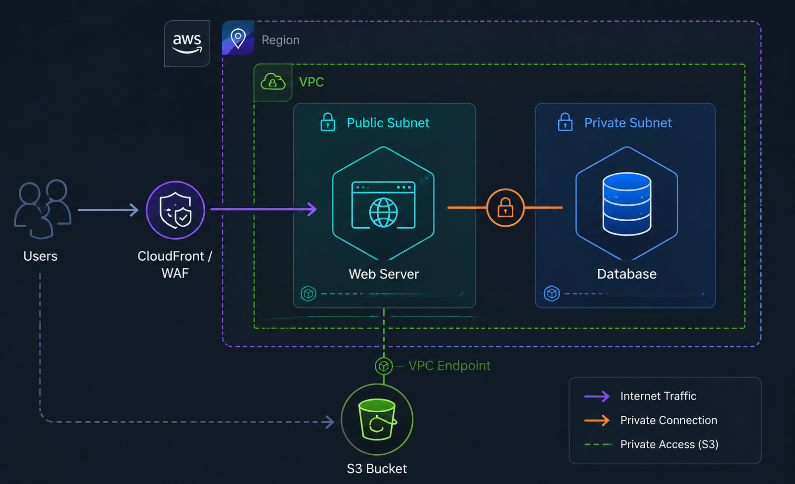
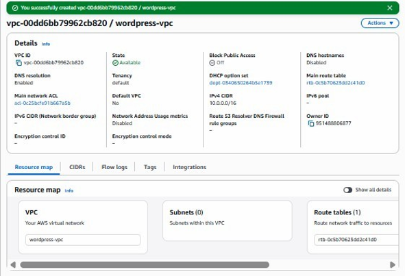
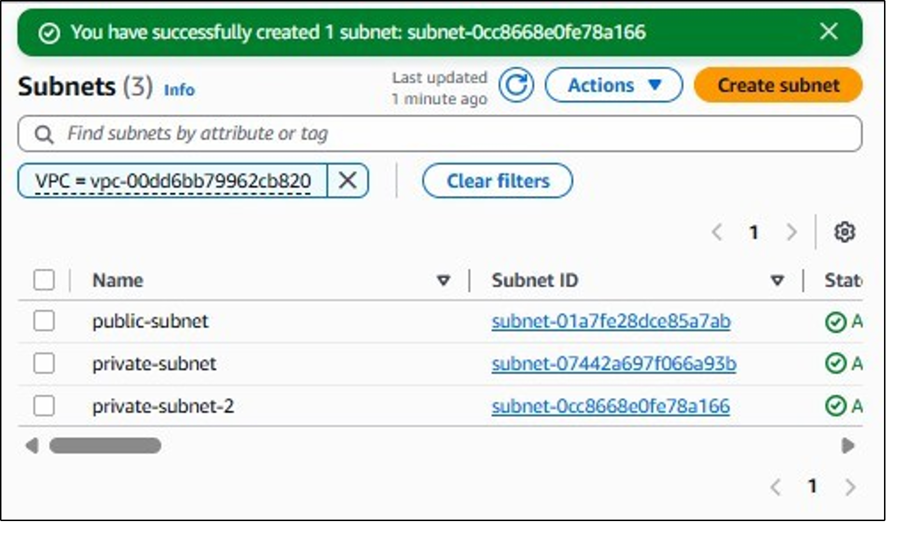
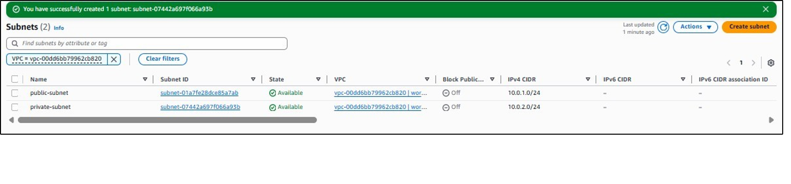
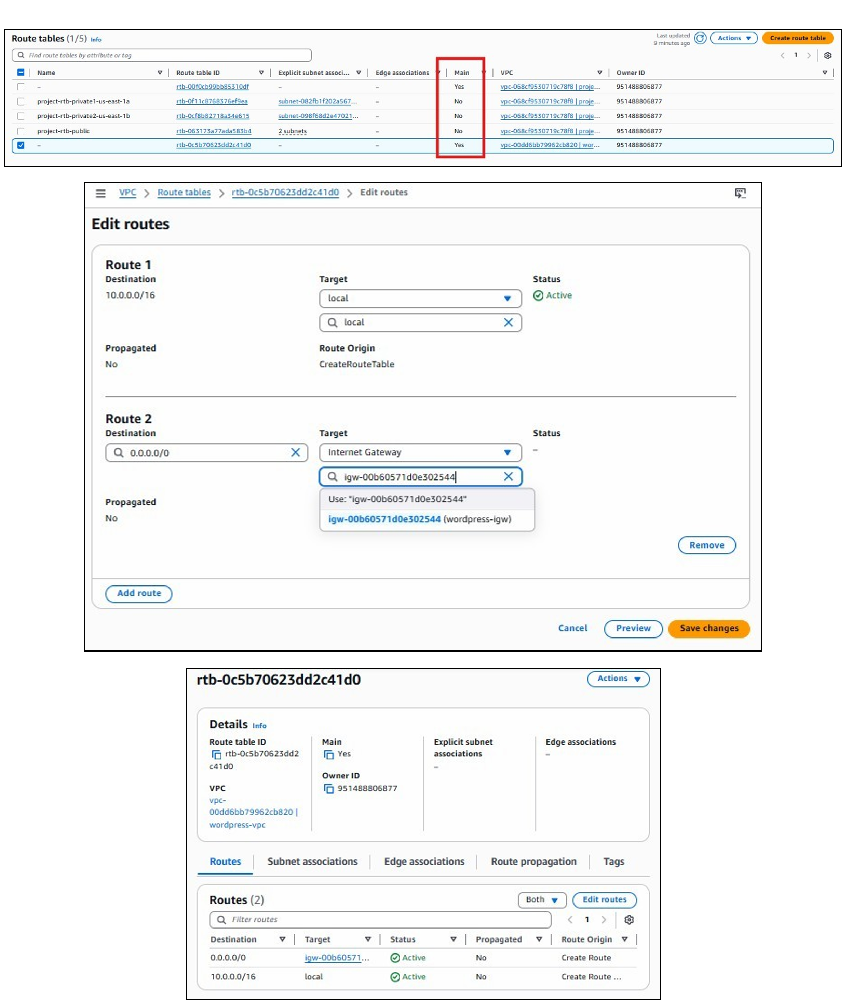
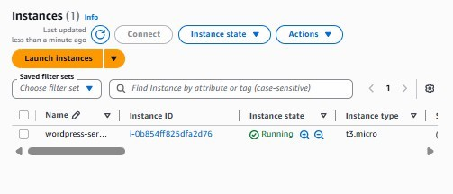
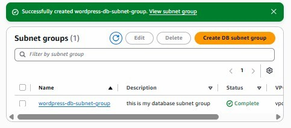
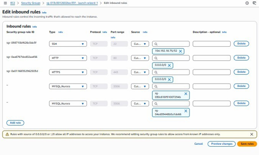
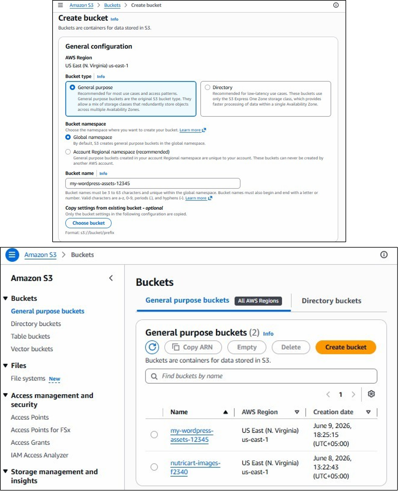
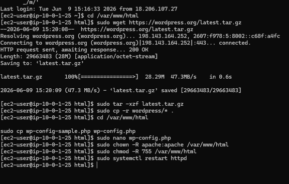

# AWS WordPress Hosting Architecture Project

# Project Title

## WordPress Website Hosting Using AWS VPC, EC2, RDS and S3

---

# Project Overview

This project demonstrates the deployment of a secure and scalable WordPress website using Amazon Web Services (AWS).

The application is designed using a three-tier cloud architecture where:

- The frontend/web layer runs on an Amazon EC2 instance.
- The database layer runs on Amazon RDS MySQL inside a private subnet.
- Static files and assets can be stored using Amazon S3.

The main goal of this project is to understand AWS networking, compute, database, and storage services by building a real-world WordPress hosting environment.

---

# Architecture Overview

                Internet
                   |
                   |
           Internet Gateway
                   |
                   |
          Public Subnet
                   |
                   |
            EC2 Instance
         (Apache + PHP + WordPress)
                   |
                   |
          Private Subnet
                   |
                   |
          RDS MySQL Database

              Amazon S3
          (Static Assets Storage)

---

# Architecture Diagram

Add your architecture screenshot below:

---

# Technologies Used

## Cloud Platform

Amazon Web Services (AWS)

## AWS Services Used

| AWS Service | Purpose |
|---|---|
| Amazon VPC | Creates isolated cloud network |
| Public Subnet | Hosts public web server |
| Private Subnet | Protects database layer |
| Internet Gateway | Provides internet connectivity |
| Route Tables | Controls network traffic |
| EC2 | Hosts WordPress application |
| RDS MySQL | Database management |
| S3 | Object storage |
| Security Groups | Firewall protection |

---

# Project Objectives

The objectives of this project are:

- Create a custom AWS network environment.
- Configure public and private subnets.
- Deploy a WordPress application.
- Connect WordPress with an RDS MySQL database.
- Secure database access.
- Store assets using Amazon S3.
- Understand AWS cloud architecture.

---

# Project Structure

AWS-WordPress-Hosting-Project
│
├── README.md
│
├── documentation
│ └── AWS_Project_Report.docx
│
├── screenshots
│ ├── architecture.png
│ ├── vpc.png
│ ├── subnet.png
│ ├── ec2.png
│ ├── rds.png
│ ├── security-group.png
│ ├── s3.png
│ ├── wordpress-install.png
│ └── dashboard.png
│
└── scripts
└── install-wordpress.sh

---

# Implementation Steps

# 1. Create Custom VPC

A Virtual Private Cloud (VPC) was created to provide an isolated network environment.

Configuration:

VPC Name:
wordpress-vpc

CIDR:
10.0.0.0/16

The VPC allows complete control over:

- IP addressing
- Routing
- Network security

Screenshot:

---

# 2. Create Public Subnet

A public subnet was created for hosting the WordPress EC2 instance.

Configuration:

Subnet:
public-subnet

CIDR:
10.0.1.0/24

Features:

- Public IP enabled
- Internet access enabled

Screenshot:

---

# 3. Create Private Subnet

A private subnet was created for the database layer.

Configuration:

Subnet:
private-subnet

CIDR:
10.0.2.0/24

The database is isolated from direct internet access.

Screenshot:

---

# 4. Internet Gateway Setup

An Internet Gateway was created and attached to the VPC.

Purpose:

- Allows EC2 instance communication with the internet.
- Enables users to access the WordPress website.

Screenshot:

---

# 5. Route Table Configuration

The public route table was configured with:

Destination:

0.0.0.0/0

Target:

Internet Gateway

The private route table only contains:

VPC CIDR → local

Screenshot:

---

# 6. EC2 Instance Deployment

An EC2 instance was launched inside the public subnet.

Configuration:

Operating System:
Amazon Linux

Application:
WordPress

Server:
Apache

Installed software:

- Apache HTTP Server
- PHP
- MySQL Client

Screenshot:

---

# 7. RDS MySQL Database

Amazon RDS was used as the WordPress database.

Configuration:

Engine:

MySQL

Version:

MySQL 8.x

Public Access:

No

The database was deployed inside the private subnet.

Screenshot:

---

# 8. Security Groups

Security groups were configured to control traffic.

## EC2 Security Group

Allowed:

SSH : Port 22

HTTP : Port 80

HTTPS : Port 443

## RDS Security Group

Allowed:

MYSQL : Port 3306

Source:

EC2 Security Group

Screenshot:

---

# 9. S3 Bucket

An S3 bucket was created for storing static files.

Features:

- Object storage
- Scalable storage
- Secure access

Screenshot:

---

# 10. WordPress Installation

WordPress was downloaded and installed on EC2.

Steps:

1. Install Apache and PHP

2. Download WordPress package

3. Configure database connection

4. Start WordPress setup

Database configuration:

Database:

wordpress

User:

wordpress

Host:

RDS Endpoint

Screenshot:

---

# 11. WordPress Dashboard

After installation, the WordPress admin dashboard was accessed.

URL:

http://EC2-PUBLIC-IP/wp-admin

Screenshot:

---

# Final Result

The WordPress website was successfully hosted on AWS.

The final system contains:

✔ Secure AWS networking  
✔ EC2 web server  
✔ RDS database  
✔ S3 storage  
✔ WordPress CMS  

---

# Testing

The following tests were performed:

| Test | Result |
|-|-|
| EC2 accessibility | Passed |
| Apache server | Passed |
| Database connection | Passed |
| WordPress installation | Passed |
| Website access | Passed |

---

# Security Considerations

The following security practices were implemented:

- Database placed in private subnet.
- RDS public access disabled.
- Security groups restricted traffic.
- SSH access limited.
- Credentials removed from GitHub.

---

# Future Improvements

Possible improvements:

- Add HTTPS using SSL certificate.
- Use Application Load Balancer.
- Add Auto Scaling.
- Enable CloudFront CDN.
- Add automated backups.
- Use AWS Secrets Manager.

---

# Documentation

Complete project report:

documentation/AWS_Project_Report.docx

---

# Author

Name:

Yusra Naveed

Project:

AWS WordPress Hosting Architecture

---

# Conclusion

This project successfully demonstrates how to deploy a WordPress website using AWS cloud services.

By combining VPC, EC2, RDS, and S3, a secure and scalable cloud architecture was created.

This project provided practical experience with AWS networking, server deployment, database management, and cloud security.
